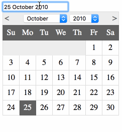
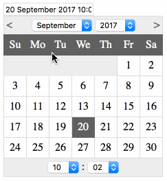

A multilanguage simple and useful jQuery datetime picker.

# Usage
- Add the "usability-datetime-picker" class to an input element and your ready to go.
- Add you can pass options using the element data like so:
    data-usability-datetime-picker-locale="de"
    
# List of Options
- data-usability-datetime-picker-locale
- data-usability-datetime-picker-format
- data-usability-datetime-picker-inline
- data-usability-datetime-picker-select-time
- data-usability-datetime-picker-select-only-time
- data-usability-datetime-picker-select-time-seconds

# Known Bugs
- When the date picker is used in multiple languages on the same page, the datepicker used later encouters a bug and starts using the locale of the first one

# Licence
usability-datetime-picker is freely distributable under the terms of the MIT license.
